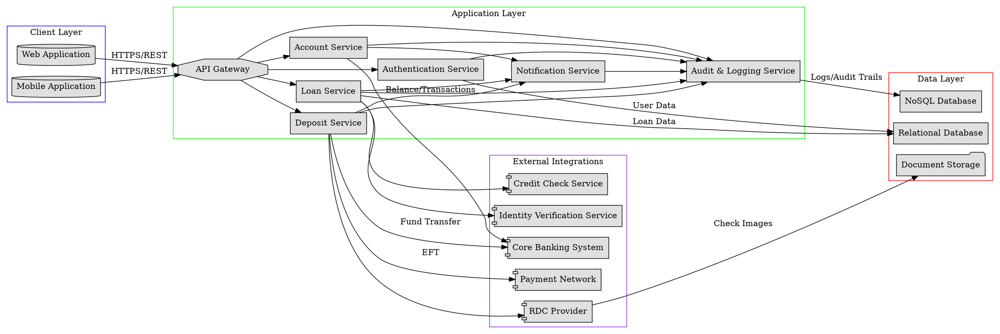

# Retail Banking Application

This project is a retail banking application that allows users to check their balance, apply for loans, and deposit funds.

## Application Architecture

- **Tech Stack**: FastAPI + React + PostgreSQL
- **High-level component diagram**:



- **How frontend and backend communicate**: The frontend and backend communicate via a RESTful API. The backend is served at `http://localhost:8000`.
- **Database schema overview**: The database schema consists of users, accounts, loans, and deposits.

## Project Structure

```
.
├── backend
│   ├── app
│   │   ├── api
│   │   │   ├── __init__.py
│   │   │   ├── accounts.py
│   │   │   ├── deposits.py
│   │   │   ├── loans.py
│   │   │   └── users.py
│   │   ├── core
│   │   │   ├── __init__.py
│   │   │   └── security.py
│   │   ├── db
│   │   │   ├── __init__.py
│   │   │   └── database.py
│   │   ├── models
│   │   │   ├── __init__.py
│   │   │   ├── account.py
│   │   │   ├── deposit.py
│   │   │   ├── loan.py
│   │   │   └── user.py
│   │   ├── schemas
│   │   │   ├── __init__.py
│   │   │   ├── account.py
│   │   │   ├── deposit.py
│   │   │   ├── loan.py
│   │   │   └── user.py
│   │   ├── __init__.py
│   │   └── main.py
│   └── tests
│       ├── __init__.py
│       ├── conftest.py
│       ├── test_accounts.py
│       ├── test_deposits.py
│       ├── test_loans.py
│       └── test_users.py
├── frontend
│   ├── index.html
│   ├── package.json
│   ├── postcss.config.js
│   ├── src
│   │   ├── App.jsx
│   │   ├── App.test.jsx
│   │   ├── components
│   │   │   ├── AccountSummary.jsx
│   │   │   ├── Balance.jsx
│   │   │   ├── Deposit.jsx
│   │   │   ├── Header.jsx
│   │   │   ├── LoanCenter.jsx
│   │   │   └── TransactionLedger.jsx
│   │   ├── index.css
│   │   ├── main.jsx
│   │   └── services
│   │       └── api.js
│   ├── tailwind.config.js
│   └── vite.config.js
├── .gitignore
└── requirements.txt
```

## Prerequisites

- Python 3.10+
- Node.js 18+
- npm
- git

## Setup Instructions

### Backend

1.  Clone the repo
2.  Create a virtual environment: `python -m venv venv`
3.  Activate the virtual environment: `source venv/bin/activate`
4.  Install the requirements: `pip install -r requirements.txt`
5.  Run the server: `uvicorn backend.app.main:app --reload`

### Frontend

1.  Navigate to the `frontend` directory: `cd frontend`
2.  Install the dependencies: `npm install`
3.  Run the development server: `npm run dev`

## API Documentation

- `POST /users/`: Create a new user.
- `POST /accounts/?user_id={user_id}`: Create a new account for a user.
- `GET /accounts/{account_id}`: Get account details.
- `POST /loans/?user_id={user_id}`: Create a new loan for a user.
- `GET /loans/{loan_id}`: Get loan details.
- `POST /deposits/?account_id={account_id}`: Create a new deposit for an account.
- `GET /deposits/{deposit_id}`: Get deposit details.

## Running Tests

### Backend

`pytest`

### Frontend

`npm test`
