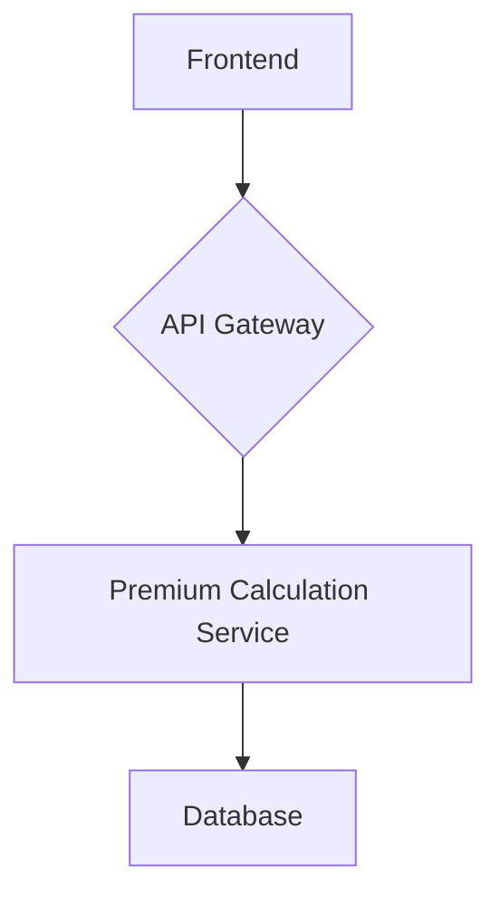

# Vehicle Insurance Premium Calculator

This project is a full-stack application that calculates vehicle insurance premiums based on a set of rules.

## Application Architecture

- **Backend**: FastAPI
- **Frontend**: React (Vite)
- **Database**: SQLite (for simplicity, can be replaced with PostgreSQL or MySQL)

### System Design



## Project Structure

```
.
├── backend
│   ├── __init__.py
│   ├── database.py
│   ├── main.py
│   ├── models.py
│   ├── routers
│   │   ├── __init__.py
│   │   └── premium_calculator.py
│   ├── schemas.py
│   └── services.py
├── frontend
│   ├── index.html
│   ├── package.json
│   ├── postcss.config.js
│   ├── src
│   │   ├── App.jsx
│   │   ├── index.css
│   │   └── main.jsx
│   ├── tailwind.config.js
│   └── vite.config.js
├── requirements.txt
└── tests
    ├── __init__.py
    ├── conftest.py
    └── test_premium_calculator.py
```

## Prerequisites

- Python 3.10+
- Node.js 18+
- npm
- git

## Setup Instructions

### Backend

1.  Create a virtual environment:
    ```bash
    python -m venv venv
    source venv/bin/activate
    ```
2.  Install dependencies:
    ```bash
    pip install -r requirements.txt
    ```
3.  Run the server:
    ```bash
    uvicorn backend.main:app --reload
    ```

### Frontend

1.  Install dependencies:
    ```bash
    cd frontend
    npm install
    ```
2.  Run the development server:
    ```bash
    npm run dev
    ```

## API Documentation

### POST /api/v1/premium-calculator

Calculates the insurance premium.

**Request Body:**

```json
{
  "ncb_level": "3_years",
  "vehicle_make": "Toyota",
  "vehicle_model": "Camry",
  "vehicle_year": 2022,
  "vehicle_type": "sedan"
}
```

**Response Body:**

```json
{
  "calculated_premium": 325.0
}
```

## Running Tests

### Backend

```bash
pytest
```
