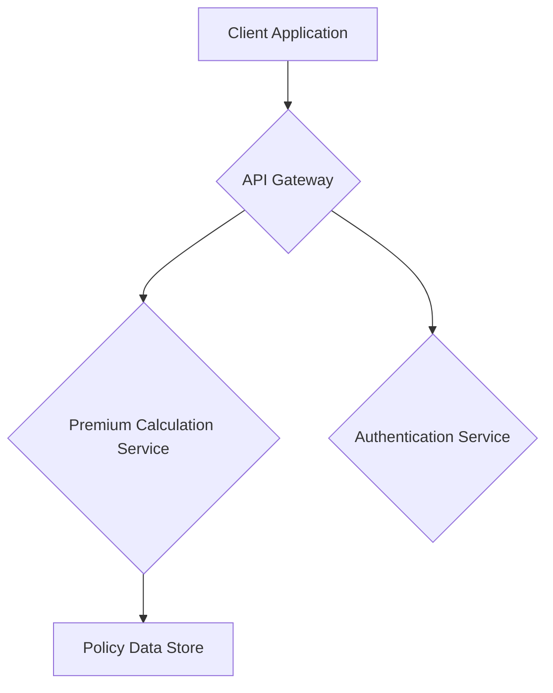

# Vehicle Insurance Premium Calculator

This project is a full-stack application that calculates vehicle insurance premiums based on a base rate, a tiered No-Claim Bonus (NCB), and a vehicle multiplier.

## Application Architecture

- **Backend**: FastAPI
- **Frontend**: React (Vite)
- **Database**: SQLite (for local development and testing)

### High-Level Diagram



## Project Structure

```
.
├── backend
│   ├── api
│   │   ├── __init__.py
│   │   └── premium.py
│   ├── core
│   │   └── __init__.py
│   ├── __init__.py
│   ├── main.py
│   ├── models
│   │   ├── __init__.py
│   │   └── policy.py
│   ├── schemas
│   │   ├── __init__.py
│   │   └── policy.py
│   └── services
│       ├── __init__.py
│       └── premium_calculator.py
├── frontend
│   ├── index.html
│   ├── package.json
│   ├── postcss.config.js
│   ├── src
│   │   ├── App.jsx
│   │   ├── index.css
│   │   └── main.jsx
│   ├── tailwind.config.js
│   └── vite.config.js
├── README.md
└── requirements.txt
```

## Prerequisites

- Python 3.10+
- Node.js 18+
- npm
- git

## Setup Instructions

### Backend

1.  Create a virtual environment:
    ```bash
    python -m venv venv
    source venv/bin/activate
    ```
2.  Install dependencies:
    ```bash
    pip install -r requirements.txt
    ```
3.  Run the server:
    ```bash
    uvicorn backend.main:app --reload
    ```

### Frontend

1.  Install dependencies:
    ```bash
    cd frontend
    npm install
    ```
2.  Run the development server:
    ```bash
    npm run dev
    ```

## API Documentation

### Calculate Premium

- **Endpoint**: `/api/v1/insurance/premium/calculate`
- **Method**: `POST`
- **Request Body**:
  ```json
  {
    "vehicle_details": {
      "value": 50000,
      "multiplier": 1.2
    },
    "ncb_tier": 0.2
  }
  ```
- **Response Body**:
  ```json
  {
    "calculated_premium": 480.0,
    "base_premium": 500.0,
    "ncb_applied": 0.2,
    "vehicle_multiplier_applied": 1.2
  }
  ```

## Running Tests

### Backend

```bash
pytest
```

