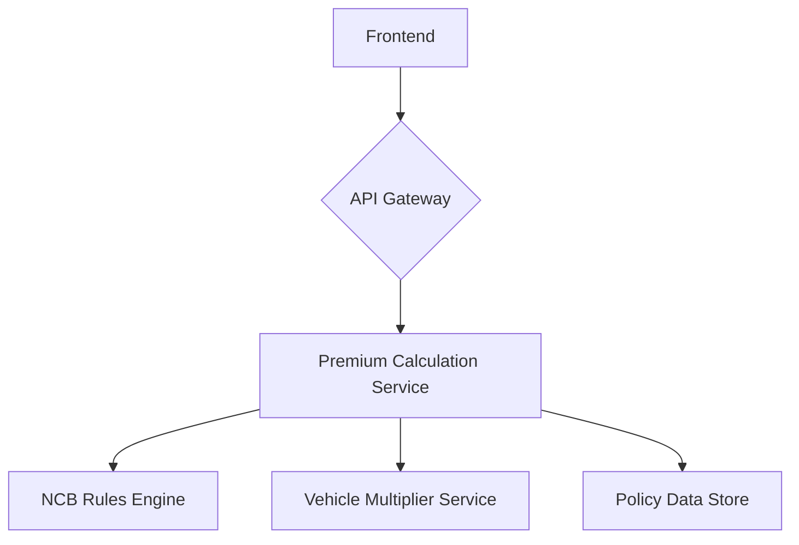

# Vehicle Insurance Premium Calculator

This project is a vehicle insurance premium calculator that provides an estimated cost based on No Claims Bonus (NCB) and vehicle details.

## Application Architecture

The application is built with a full-stack architecture using FastAPI for the backend and React for the frontend.

- **Backend**: FastAPI, SQLAlchemy, PostgreSQL (SQLite for local development)
- **Frontend**: React, Vite, Tailwind CSS

### System Diagram



## Project Structure

```
.
├── backend
│   ├── api
│   │   └── v1
│   │       └── endpoints
│   │           └── premium.py
│   ├── crud.py
│   ├── database.py
│   ├── main.py
│   ├── models.py
│   └── schemas.py
├── frontend
│   ├── public
│   ├── src
│   │   ├── components
│   │   │   ├── Calculator.jsx
│   │   │   ├── Header.jsx
│   │   │   └── Sidebar.jsx
│   │   ├── App.jsx
│   │   ├── index.css
│   │   └── main.jsx
│   ├── index.html
│   ├── package.json
│   ├── postcss.config.js
│   ├── tailwind.config.js
│   └── vite.config.js
├── requirements.txt
└── tests
    ├── test_crud.py
    └── test_premium.py
```

## Prerequisites

- Python 3.10+
- Node.js 18+
- npm
- git

## Setup Instructions

### Backend

1.  Clone the repository.
2.  Create a virtual environment: `python -m venv venv`
3.  Activate the virtual environment: `source venv/bin/activate`
4.  Install the dependencies: `pip install -r requirements.txt`
5.  Run the backend server: `uvicorn backend.main:app --reload`

### Frontend

1.  Navigate to the `frontend` directory: `cd frontend`
2.  Install the dependencies: `npm install`
3.  Run the frontend development server: `npm run dev`

## API Documentation

### POST /api/v1/insurance/premium

Calculates the insurance premium.

**Request Body:**

```json
{
  "ncb_years": 4,
  "vehicle_make": "Toyota",
  "vehicle_model": "Camry",
  "vehicle_year": 2020,
  "engine_size_cc": 2500
}
```

**Response Body:**

```json
{
  "premium": 200.00
}
```

## Running Tests

### Backend

`pytest`

### Frontend

`npm test`
