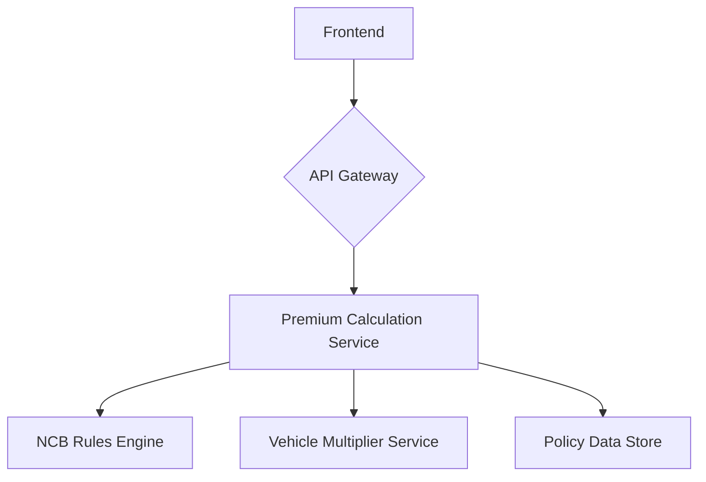

# Vehicle Insurance Premium Calculator

This project is a vehicle insurance premium calculator that allows users to calculate their insurance premium based on their No Claims Bonus (NCB) and vehicle details.

## Application Architecture

- **Tech Stack**: FastAPI (Python) for the backend, React for the frontend, and PostgreSQL for the database.
- **High-level component diagram**:



- **Frontend-Backend Communication**: The frontend communicates with the backend via a RESTful API. The main endpoint is `/api/v1/insurance/premium`.
- **Database Schema**: The database consists of three main tables: `customers`, `vehicles`, and `policies`.

## Project Structure

```
.
├── backend
│   ├── app
│   │   ├── api
│   │   │   └── v1
│   │   │       └── endpoints
│   │   │           └── premium.py
│   │   ├── core
│   │   │   └── config.py
│   │   ├── db
│   │   │   └── database.py
│   │   ├── models
│   │   │   └── policy.py
│   │   ├── schemas
│   │   │   └── policy.py
│   │   └── services
│   │       ├── premium_calculator.py
│   │       └── policy_service.py
│   ├── main.py
│   └── requirements.txt
├── frontend
│   ├── src
│   │   ├── components
│   │   │   ├── Calculator.jsx
│   │   │   ├── Header.jsx
│   │   │   └── Sidebar.jsx
│   │   ├── App.jsx
│   │   ├── index.css
│   │   └── main.jsx
│   ├── index.html
│   ├── package.json
│   ├── postcss.config.js
│   ├── tailwind.config.js
│   └── vite.config.js
└── tests
    ├── conftest.py
    ├── test_policy_service.py
    └── test_premium.py
```

## Prerequisites

- Python 3.10+
- Node.js 18+
- npm
- git

## Setup Instructions

### Backend

1.  **Clone the repo**
2.  **Create a virtual environment**: `python -m venv venv`
3.  **Activate the virtual environment**: `source venv/bin/activate`
4.  **Install requirements**: `pip install -r backend/requirements.txt`
5.  **Run the server**: `uvicorn backend.main:app --reload`

### Frontend

1.  **Navigate to the frontend directory**: `cd frontend`
2.  **Install dependencies**: `npm install`
3.  **Start the dev server**: `npm run dev`

## API Documentation

### `POST /api/v1/insurance/premium`

Calculates the insurance premium.

**Request Body**:

```json
{
  "ncb_years": 4,
  "vehicle_make": "Toyota",
  "vehicle_model": "Camry",
  "vehicle_year": 2020,
  "engine_size_cc": 2500
}
```

**Response**:

```json
{
  "premium": 200.00
}
```

## Running Tests

- **Backend**: `pytest`
- **Frontend**: `npm test`
